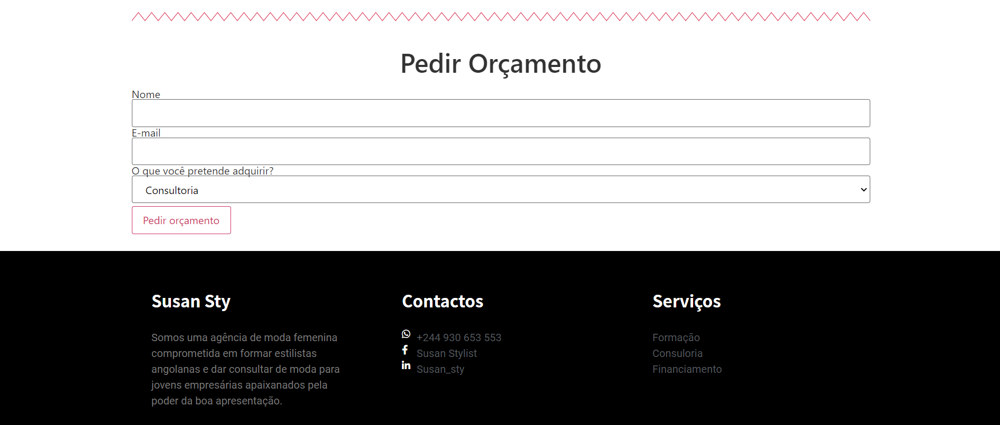
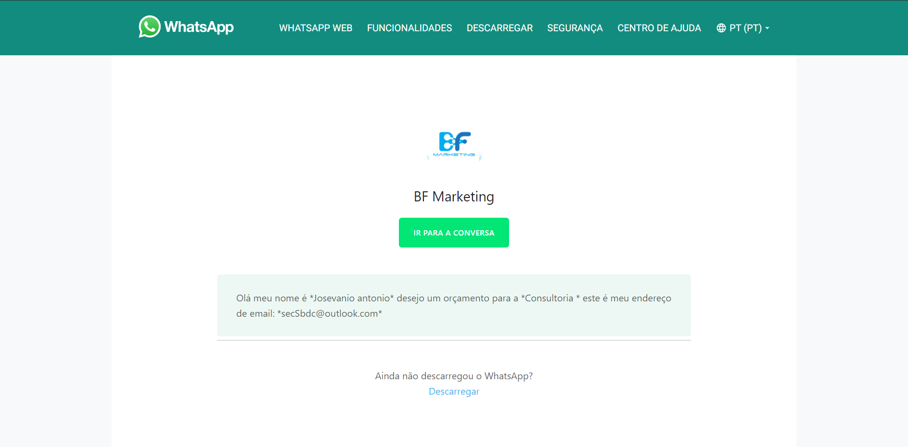

# Plugin-WP-de-orcamento-via-whatsapp

Este plugin de Wordpress foi feito em PHP e o seu objectivo principal é de gerar um formulário de orçamento via whatsapp.
Você pode ver as fotos abaixo ou ir direto ao site aqui: [http://susanstylist.rf.gd/ti/?i=2](http://susanstylist.rf.gd/ti/?i=2).

## Objectivos: 

● Possibilitar efectuar vendas através do whatsapp 
● Facilitar a comunicação entre cliente e vendedor 
● Obtenção de público quente para uma determinada empresa

## O que é que o programa faz? 

● Acesso ao banco de dados Wordpress 
● Adicionar um menu no dashboard do Wordpress 
● Adicionar e eliminar produtos 
● Adicionar e eliminar número do whatsapp 
● Criação de um formulário para redicionamento no whatsapp 
● Acesso a API do whatsapp

## Benefícios: 

● Baixo custo 
● Pouco espaço de armazenamento 
● Facilidade de instalação 
● Facilidade de uso 
● Controlo de clientes

### Página inicial

### Formulário do orçamento

### Redirecionamento ao WhatsApp

